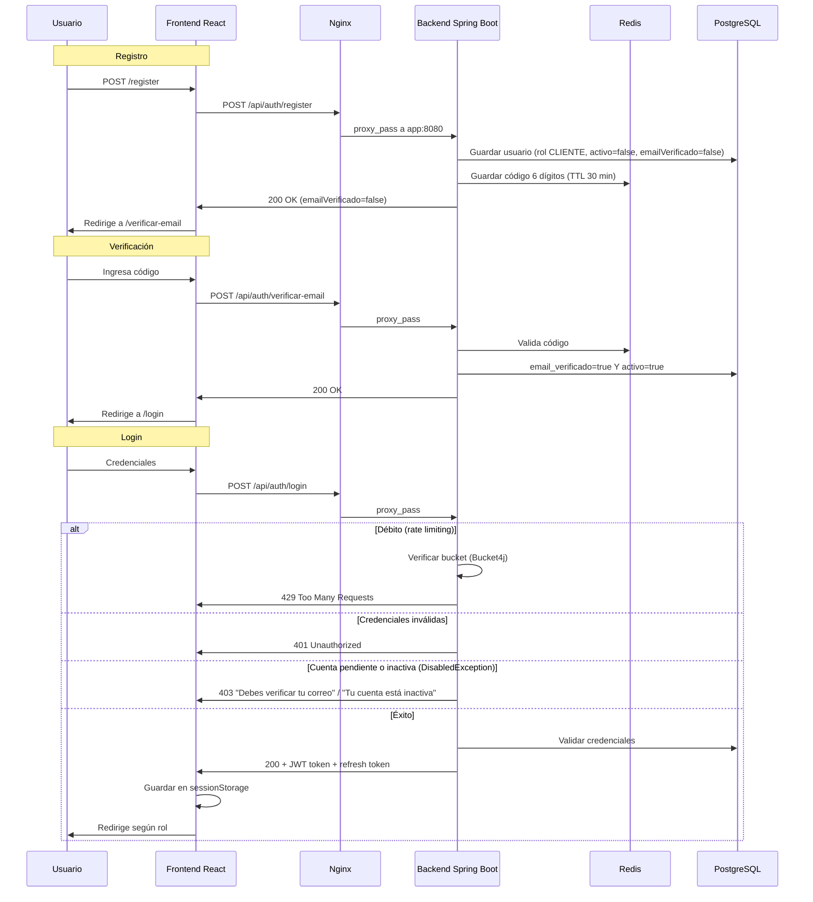

# Flujo de Autenticación

> Cómo funciona la autenticación y autorización en el sistema.

## Diagrama de flujo

## Flujo de tokens

| Token | Duración | Propósito | Almacenamiento |
|---|---|---|---|
| **Access Token** (JWT) | 24 h | Autenticar peticiones API | `sessionStorage` (frontend) |
| **Refresh Token** | 7 días | Renovar access token (rotativo) | `sessionStorage` + BD (`refresh_tokens`) |

### Renovación automática

1. El interceptor de Axios detecta `401`
2. Llama a `POST /api/auth/refresh` con el refresh token
3. El backend revoca el refresh token usado y emite uno nuevo
4. Si el token ya fue rotado (reuso), se revoca toda la familia
5. Si la renovación falla, se cierra la sesión

### Cierre de sesión

- `POST /api/auth/logout`: blacklist del access token en Redis + revocación del refresh token en BD
- Sesión por inactividad: [[03 - Frontend/Estado Global y Servicios|useSessionTimeout]] cierra tras 60 min sin actividad
- `sessionStorage`: al cerrar pestaña se pierde la sesión (requisito de seguridad)

## Roles y permisos

| Rol | Acceso |
|---|---|
| **ADMIN** | Total: usuarios, ordenes, inventario, auditoría, configuración del sistema |
| **JEFE_TALLER** | Gestión operativa de órdenes, inventario, usuarios de staff |
| **MECANICO** | Ejecución de órdenes de trabajo, consulta de inventario |
| **CLIENTE** | Solo sus vehículos, reservas e historial |

### Guardas en frontend ([[03 - Frontend/Estructura y Rutas|App.tsx]])

- `RutaStaff`: ADMIN / JEFE_TALLER / MECANICO
- `RutaCliente`: solo CLIENTE
- `RutaProtegida`: cualquier autenticado

## Seguridad implementada

- **Rate limiting**: 5 intentos/min en `/api/auth/login` (Bucket4j)
- **Blacklist de tokens**: Redis con TTL (prefijo `blacklist:`)
- **Recuperación de contraseña**: token de un solo uso con TTL
- **Verificación de email**: código 6 dígitos, TTL 30 min, prefijo Redis `verif:`
- **Cuenta pendiente**: con SMTP habilitado el registro crea la cuenta `activo=false` hasta verificar; el refresh de tokens se bloquea para cuentas inactivas/sin verificar
- **Refresh token rotativo**: detección de reuso
- **BCrypt factor 12**: passwords
- **JWT_SECRET** desde variable de entorno
- **Headers HTTP**: HSTS, X-Frame-Options, CSP, X-Content-Type-Options, Referrer-Policy

Volver a [[Home]].