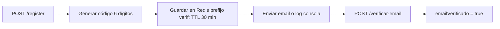

# Módulos del Backend

> Paquete base: `com.voltiosyruedas.taller`. Monolito modular: cada dominio tiene `entity/`, `dto/`, `repository/`, `service/` y `controller/`.

## Tabla de módulos

| Módulo | Paquete | Responsabilidad | Paquetes principales |
|---|---|---|---|
| Authorización | `auth/` | Usuarios, roles, login/register, JWT, perfil, preferencias, recuperación y verificación de email | `AuthController`, `UsuarioController`, `AuthService`, `UsuarioService`, `EmailVerificationService`, `PasswordResetService` |
| Reservas | `reservas/` | Citas de servicio, mis-reservas, cancelar, CRUD staff | `ReservaController`, `ReservaService` |
| Taller | `taller/` | Órdenes de trabajo, estados, bitácora, repuestos por orden | `OrdenTrabajoController`, `OrdenTrabajoService` |
| Vehículos | `vehiculo/` | Cuenta de vehículos de clientes, estados, CRUD por rol | `VehiculoController`, `VehiculoService` |
| Inventario | `inventario/` | Repuestos, stock bajo, activos, CRUD, ajuste de stock | `InventarioController`, `InventarioService` |
| Notificaciones | `notificaciones/` | Notificaciones en panel, avisos al staff | `NotificacionController`, `NotificacionService`, `MailService` |
| Auditoría | `auditoria/` | Registro de acciones del sistema | `AuditoriaController`, `AuditService`, `AuditoriaLog` |
| Común | `common/` | Excepciones, respuestas de error, configs Render | `ApiException`, `ErrorResponse`, `ApiResponse`, `RenderDataSourceConfig`, `RenderRedisConfig` |

---

## auth/

### Entidades
- **Usuario**: nombre, apellido, email (único), password (BCrypt), teléfono, dirección, activo, preferencias (JSON), **emailVerificado** (V5). Validaciones en entidad (cierra el hueco de `POST/PUT /api/usuarios`).
- **Rol**: `ADMIN`, `JEFE_TALLER`, `MECANICO`, `CLIENTE` (seed en V1).
- **RefreshToken**: token, expiración, revocado, `jti` único (rotación/reuso).

### Estados del registro

> Si `app.mail.enabled=false` (dev) la cuenta queda **verificada automáticamente** para no bloquear el login.

### Validación de teléfono (Costa Rica)
Patrón: `PATTERN_TELEFONO` en `Usuario`: `^(|(\+506[ -]?)?\d{4}[ -]?\d{4})$`.
- Acepta vacío, `8888 8888`, `+506 8888 8888`, `8888-8888`, etc.
- Teléfonos no CR quedan rechazados.
- Reutilizado en `RegisterRequest` y `ActualizarPerfilRequest`.

---

## reservas/
- Entidad `Reserva`: cliente, fecha_hora, descripción, categoría_servicio, estado (`PENDIENTE`, `CANCELADA`, `COMPLETADA`, ...).
- Estados no editables: `CANCELADA`, `COMPLETADA`.
- `mis-reservas` (cliente), `fecha` (staff), CRUD completo, `cancelar`.
- Regla: el cliente solo puede editar/cancelar sus propias reservas (verificación de propiedad en controlador).
- Devuelve `ReservaResponse` (DTO) para evitar el error `HTTP 500` por proxy lazy de Hibernate.

---

## taller/
- Entidad `OrdenTrabajo`: reserva opcional, cliente, mecánico, `numero_orden` único, descripciones, estado, costos (mano de obra + repuestos = total).
- Estados (V1 CHECK constraint): `RECIEN_INGRESADO`, `POR_INGRESAR`, `TRABAJANDO`, `TERMINADO`, `ENTREGADO`.
- `Bitacora`: historial de cambios por orden (usuario, acción, estado anterior → nuevo).
- `OrdenTrabajoInventario`: repuestos usados por orden (cantidad, precio_unitario, subtotal GENERATED).
- `mi-historial` incluye bitácora y facturación (mapearRespuesta con `incluirDetalles`).

---

## inventario/
- Entidad `Inventario` (repuesto): código único, nombre, categoría, marca, modelo, `stock_actual`, `stock_minimo`, precios, ubicación, proveedor, activo.
- `stock-bajo` = `stock_actual <= stock_minimo`.
- `ajustarStock` transaccional; `crear/actualizar/eliminar` auditan y notifican al staff si el stock queda bajo.

---

## vehiculo/
- Entidad `Vehiculo`: cliente, placa (única), marca, modelo, año, color, kilometraje, estado, notas.
- Estados (V2 CHECK): `DISPONIBLE`, `EN_TALLER`, `EN_REPARACION`, `LISTO`, `ENTREGADO`.
- El cliente crea/edita **solo sus propios** vehículos; staff puede asignar cliente o cambiar estado.

---

## notificaciones/
- `Notificacion`: usuario, título, mensaje, tipo, leída, fecha.
- `MailService`: envío de correos por SMTP (Gmail por defecto). Si `MAIL_ENABLED=false` registra por consola.

## auditoria/
- `AuditoriaLog`: usuario, email, acción, entidad, entidad_id, detalle, IP, fecha.
- `AuditService.registrar(...)` usado en operaciones de auth, reservas, órdenes e inventario.

## common/
- `ApiException`: excepción de negocio con status tipado (401/400/409/404...).
- `ErrorResponse`: respuesta de error uniforme (`código`, `mensaje`, `detalles`, `timestamp`).
- `ApiResponse<T>`: envoltorio de éxito.
- `GlobalExceptionHandler`: asocia excepciones → códigos HTTP.

Volver a [[Home]].