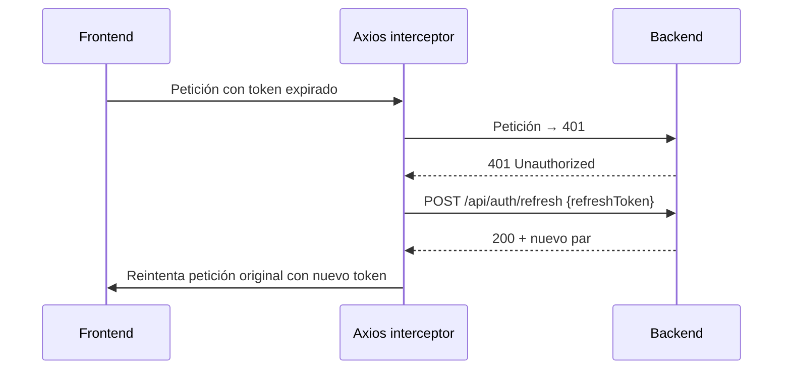

# Estado Global y Servicios

> Zustand para estado global y servicios Axios para comunicación con el backend.

## Stores (Zustand)

### `authStore` (`store/authStore.ts`)

- Estado: `user`, `token`, `refreshToken`, `isAuthenticated`.
- Acciones: `login`, `setTokens`, `setUser`, `logout`.
- Persistido en **`sessionStorage`** (clave `auth-storage`): al cerrar pestaña se pierde la sesión.
- `login(JwtResponse)` reconstruye el `user` con el rol.

### `uiStore` (`store/uiStore.ts`)

- Estado: tema (light/dark/system), notificaciones toast (`notificaciones` con `action` opcional).
- Fuente única de tema: aplica clase `dark` en `<html>`, persist en localStorage, init sin parpadeo en `index.html`.
- `notificationAction` permite toasts con botón (ej. "Ir a iniciar sesión" en registro duplicado).

## Cliente HTTP (`services/api.ts`)

- Axios con `baseURL` vacío (mismo origen → nginx proxy) o `VITE_API_URL`.
- Interceptor de **request**: inyecta `Authorization: Bearer {token}`.
- Interceptor de **response**:
  - `401` + no retry + no `/api/auth/refresh` → renueva token (una sola vez con `refreshPromise` compartido).
  - Refresh falla → cierra sesión y redirige a `/login`.
  - Propaga `error.response.data.mensaje` legible al error.
  - `cerrarSesion()`: notifica logout al backend (revoca refresh) y limpia el store.

## Servicios por dominio (`services/`)

| Archivo | Recurso |
|---|---|
| `authService.ts` | login, register, logout, refresh, verificarEmail, reenviarCodigo, me, preferencias, recuperar/reestablecer password, cambiar password |
| `usuarioService.ts` | usuarios CRUD + listar mecánicos |
| `reservaService.ts` | reservas |
| `ordenService.ts` | órdenes de trabajo, bitácora, repuestos |
| `inventarioService.ts` | inventario |
| `vehiculoService.ts` | vehículos |
| `notificacionesService.ts` | notificaciones |
| `preferenciasService.ts` | preferencias del usuario |
| `api.ts` | instancia Axios compartida |

> **Importante**: todos los servicios usan el prefijo `/api/`. Un servicio sin `/api/` devuelve el `index.html` (200) y crashea las páginas de cliente (bug corregido).

## Tipos (`types/`)

- `auth.ts`: JwtResponse, UsuarioResponse, LoginRequest, RegisterRequest, VerificarEmailRequest, etc.
- `reservas.ts`, `ordenes.ts`, `inventario.ts`, `vehiculo.ts`, `notificaciones.ts`, `preferencias.ts`, `index.ts`.

## Flujo de renovación de sesión

Volver a [[Home]].