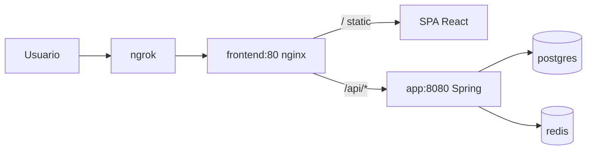

# ngrok y URL Pública

> Exposición del frontend local con una URL HTTPS pública usando ngrok.

## Estado actual

- Dominio estático (plan free): **https://vocalist-wrongly-pedometer.ngrok-free.dev**
- Servicio: `ngrok` en `compose.ngrok.yml` (overlay), contenedor `voltios_ruedas_ngrok`.
- Apunta a `http://frontend:80` (nginx del frontend), que proxya `/api/*` a `app:8080`.

## Cómo funciona



## Uso

```powershell
# Levantar el stack completo con ngrok
docker compose -f compose.yml -f compose.ngrok.yml up -d --build

# Ver la URL pública (se muestra en logs al arrancar)
docker compose -f compose.yml -f compose.ngrok.yml logs -f ngrok

# Reiniciar solo ngrok si la URL cambió
docker compose -f compose.yml -f compose.ngrok.yml restart ngrok
```

## Requisitos

- `NGROK_AUTHTOKEN` en `.env` (dashboard: https://dashboard.ngrok.com/get-started/your-authtoken).
- Cuenta free con dominio estático reservado (`vocalist-wrongly-pedometer.ngrok-free.dev`).

## Notas

- CORS permitido por patrones (same-origin detrás de ngrok → no hay 403 en login).
- El header `ngrok-skip-browser-warning` está permitido en CORS.
- El túnel **no se quita** al reconstruir el stack base: `compose.ngrok.yml` es un overlay que convive con los servicios base.
- Para acceder sin avisos de ngrok en el navegador se puede usar `https://vocalist-wrongly-pedometer.ngrok-free.dev` (dominio).

Volver a [[Home]].